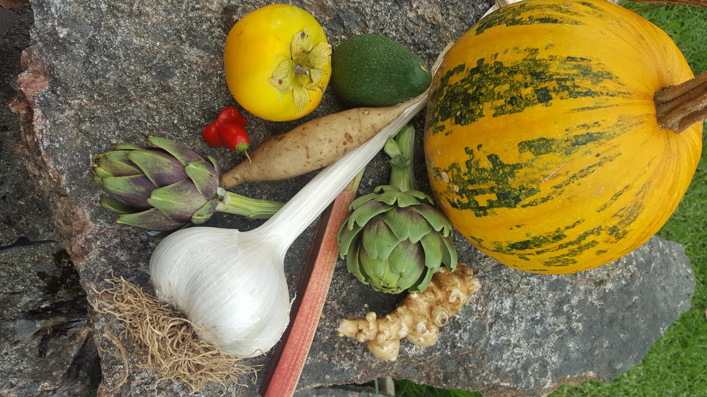

Scientists from the [Australian National Phenome Centre](https://www.murdoch.edu.au/research/anpc) at [Murdoch University](https://www.murdoch.edu.au) are currently studying how quickly different types of dietary fibres reach our lower gut and change into compounds that could potentially improve our health.

We invite you to help us learn more about dietary fibres.  This involves attending two-day visits, with at least one week between each visit, at the Harry Perkin Institute in Murdoch.  During these visits, you will have the opportunity to:

-	Receive a personalised session with a dietician, who will teach you about dietary fibres and guide you on how much fibre you should eat each day.
-	Attend education sessions where you will learn more about how fibres improve our health.
-	Enjoy up to three days of the study meals.

## **Can you help The FIBRE Study?**
If you are aged between 18 and 70, you may be eligible to participate in this study.  

## **About the FIBRE Study**
Consuming dietary fibre has the potential to reduce our risk of disease.  Unfortunately, Australians are not eating enough dietary fibre on a daily basis.  

Associate Professor Ruey Leng Loo from the Australian National Phenome Centre is leading this research trial, which aims to investigate different types of fibre and their potential influence on our health. 

## **Trial objectives**
-	To find out how quickly different types of fibre travel through our gut
-	To identify the chemical compounds that are produced in our blood, urine, and/or faeces, after eating different dietary fibres.
-	To explore how these chemical compounds can affect our health.

## **Frequently asked questions**

### 1.	What is the study design?
You will eat one of eight different vegetables or fruits in each clinic visit along with a standardised low fibre meal plan.  These meals will be provided as part of the study.  

### 2.	What are the choices of vegetables and fruits? 
You can choose from vegetables that contain inulin, a fibre known to be beneficial for your gut health.  These vegetables include yacon, Jerusalem artichoke, globe artichoke, and elephant garlic. They are sourced from an organic farm in Western Australia, Mt Lindesay. We also have fruits that contain different types of fibres, including apple, watermelon, orange, and tomato.  

On the consent form, you can choose all the fruit and vegetable options that you are willing to consume.

### 3.	What is a low fibre meal, and do I have to prepare them? 
The low fibre meal plan includes white bread and butter for breakfast, chicken pasta in white sauce for lunch and dinner. These will be provided to you as well as cheese and crackers as snacks. Minimal preparation will be required we do however require that you only consume the meals provided to you to ensure consistency in our results. 

If you have any food allergies or intolerances, please get in touch with us. 

### 4.	What does it involve?
You will need to attend two clinic visits.  

During the first visit (screening), we will check your eligibility by having you consume a small amount of inulin powder dissolved in water.  You will the undergo a hydrogen breath test by exhaling into a hand-held machine. This will be repeated every hour for 8 hours.  This test will determine your eligibility to participate in the study. 

If you are eligible, we will provide you with the low fibre meals and snacks ahead of your second clinic visit. 

Twenty-four hours before your second clinic visit, consume the low fibre meals provided. During the clinic visit, you will continue with the low fibre diet.  However, for breakfast, we will provide you with up to three portions of dietary fibres of your choice.  

You will perform hydrogen breath tests every hour for 8 hours. Additionally, a nurse will also collect blood samples every hour through a tube in the vein and collect a urine sample every two hours to gather more information about what is happening inside your body. If you feel comfortable, you can even provide a stool sample.  

During each clinic visit, you are welcome to continue working using your laptop or perform any relevant activities. Alternatively, we recommend bringing books, magazines, newspapers, to keep yourself occupied during the clinic visit. WIFI access can be provided to you on request.  

### 5.	When do I have to attend the clinic visit? 
The researcher will arrange a convenient date with you, usually on Tuesday, Thursday or Friday.  On occasion, we may be able to schedule the clinic on Saturday.

### 6.	Is there any reimbursement for my time and travel cost? 
You will receive $1.2 per 10km and the parking fees for the day.  If you use public transport, we will cover your bus or train fares.  Additionally, you will receive a gift voucher worth $25 for completing the screening visit and an additional $50 for completing the study clinic visit.  

### 7.	Who is funding the study?
The study is supported by [Future Food System Cooperative Research Centre (FFS CRC)]( https://www.futurefoodsystems.com.au/project/bioactive-components-for-value-add-to-australian-artichokes/) and Murdoch University, in collaboration with [Mt Lindesay](ML.docx).

### 8.	Who has approved this study?
The study has been reviewed and approved by the Murdoch University Human Ethics Committee (study reference number 2023/068).

### 9.	Interested in participating?
To find out more by reading the [study information sheet here](PARTICIPANT_INFORMATION_SHEET_V2.docx). You can also complete the [electronic consent here](https://mdhs-redcap.meddent.uwa.edu.au/fmdhs/surveys/?s=FH3747TCYCPKJEPD).

### Project Team Members

